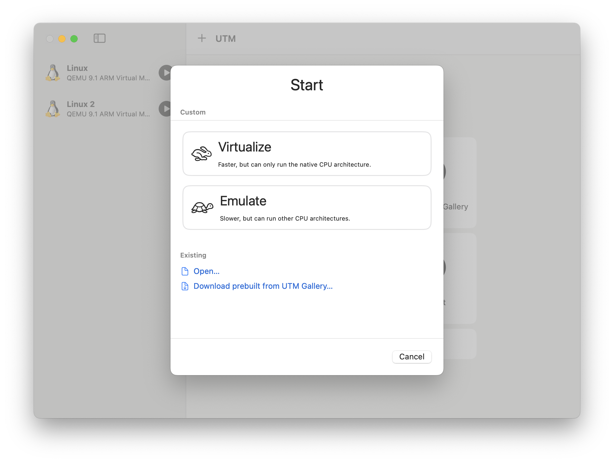

# [Mac OS/M1] UTM에 Windows 11 가상머신 설치하기

## 사용 환경

- **칩**: MacBook M1 Pro  
- **macOS 버전**: macOS Sonoma 14.6.1  
- **UTM 버전**: 4.6.5  
- **Windows 빌드**: Windows 11 Client ARM64 Insider Preview (Dev) -Build 26100.1150  

## 대표적인 설치 방식 2가지: VHDX vs ISO

| 항목   | ISO 파일                        | VHDX 파일                             |
|--------|----------------------------------|----------------------------------------|
| 용도   | 설치용 디스크 이미지            | 가상 하드디스크 이미지                |
| 설명   | 운영체제를 설치하거나 부팅할 때 사용 | 윈도우가 설치된 상태로 바로 실행 가능 |
| 비유   | 윈도우 설치 CD                  | 윈도우가 이미 설치된 가상 컴퓨터     |

## VHDX 방식 설치

> ISO 설치: 링크 추가 요망

### 설치 요약

1. Windows 11 ARM VHDX 파일 다운로드  
2. UTM 설치  
3. 새 Window VM 생성  
4. VM 실행 후 인터넷 연결  
5. 언어/지역 변경  

### 설치 방법

#### 1. [Windows 11 ARM VHDX 파일 다운로드](https://www.microsoft.com/en-us/software-download/windowsinsiderpreviewARM64)

- Microsoft 로그인 전  
  

- Microsoft 로그인 후  
  Windows 11 Client ARM64 Insider Preview (Dev) -Build 26100.1150 에디션 선택 후 다운로드  
  

#### 2. [UTM 설치](https://mac.getutm.app)

#### 3. 새 Window VM 생성

- Import VHDX Image 선택  
- Boot VHDX Image에 1.에서 다운받은 파일 첨부  
  

#### 4. VM 실행 후 인터넷 연결

- Shift + Fn + F10키 눌러 CMD 창 열기  
- CMD 창에 `taskmgr` 을 입력해 작업 관리자 실행  

- Run new task 클릭 후, 실행 창에 `cmd` 입력  
- Create this task with administrative privileges 클릭 후 OK  
- CMD 창에 `oobe\bypassnro` 입력해 인터넷 연결 없이 로컬 계정 생성  
- I don't have internet 클릭  

- D드라이브 열어 `utm-guest-tools` 설치  
- 인터넷 연결 확인 (재부팅)

#### 5. 지역/언어 변경

- Settings > Time & Language > Region: Korea

- Add a language > 한국어 > Set as my Windows display language 선택  
- Command + Space키 눌러 한/영 자판 전환

