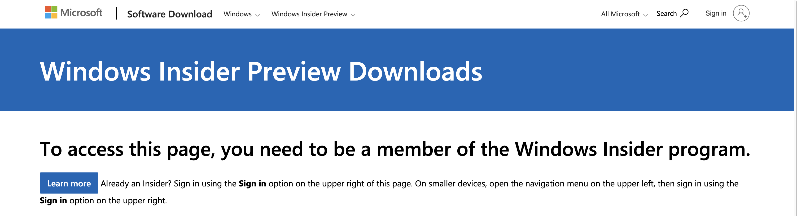
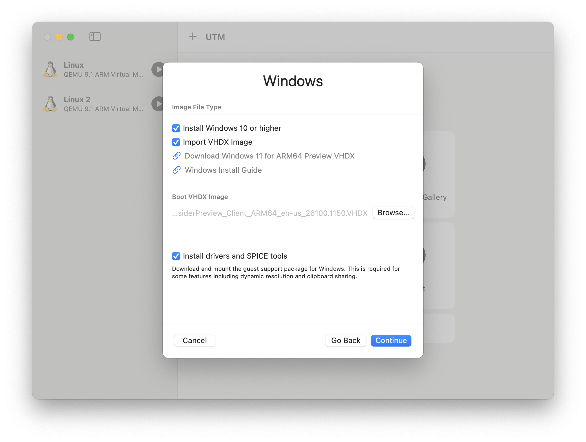
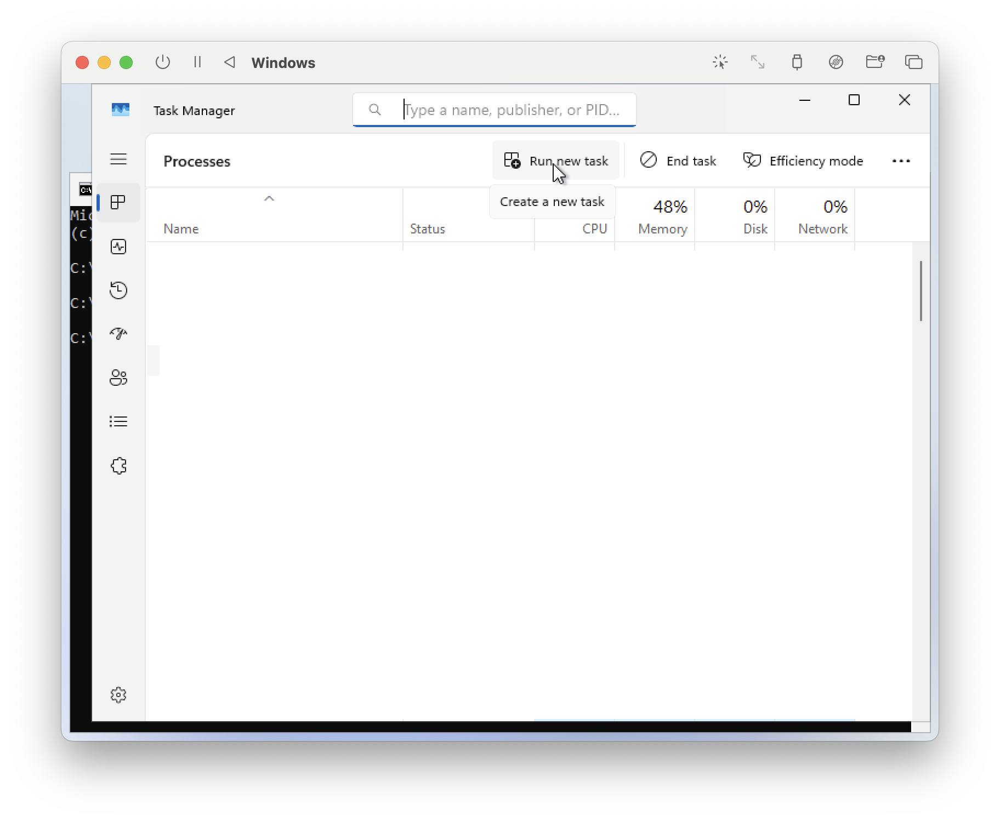
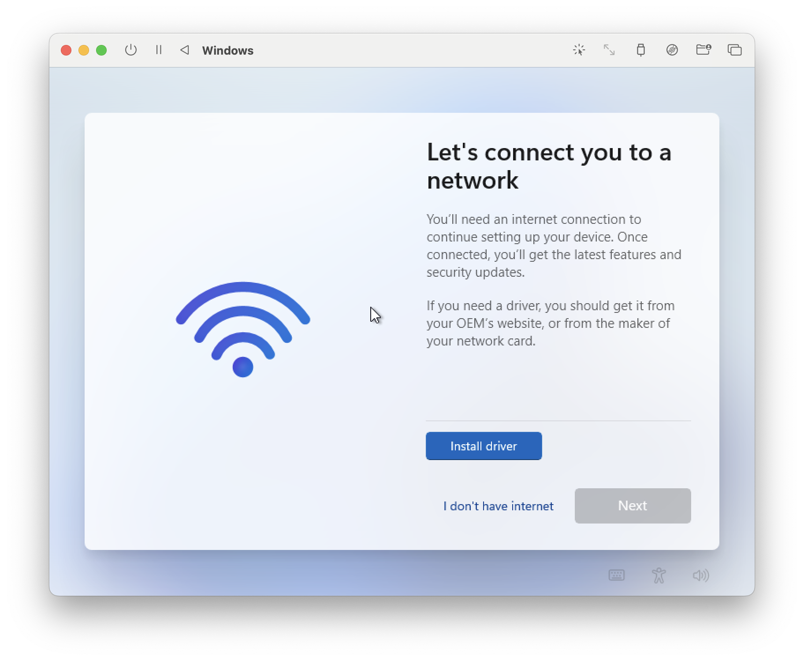
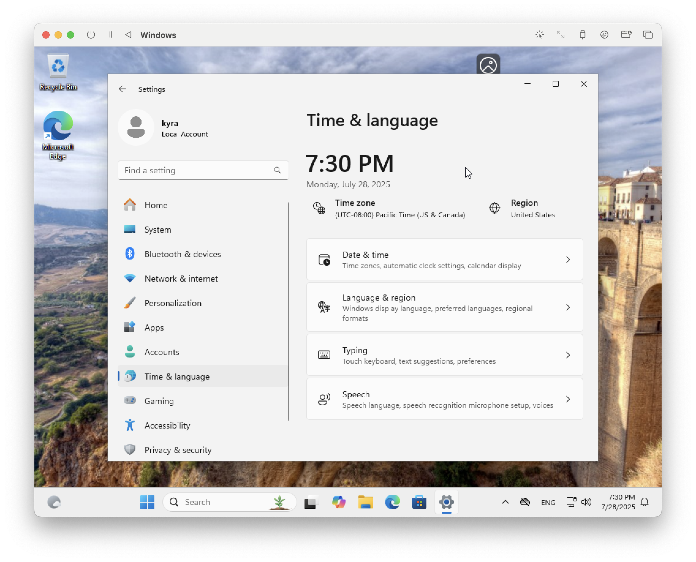
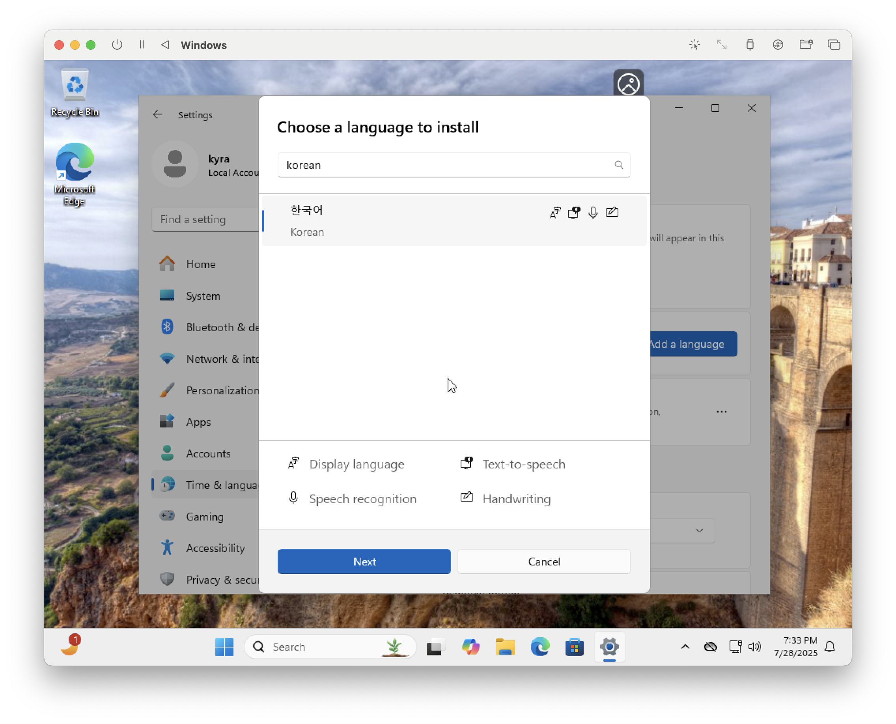
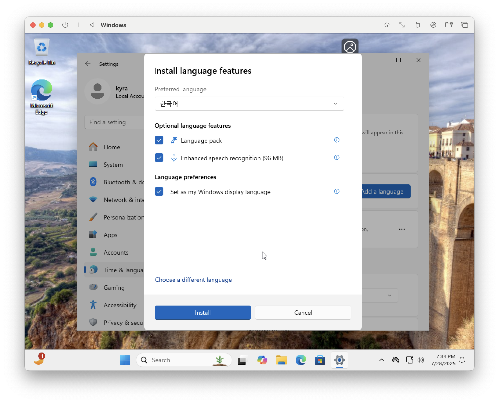
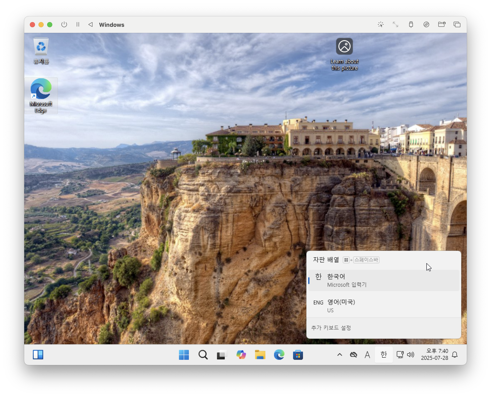

# [Mac OS/M1] Installing Windows 11 Virtual Machine on UTM

## System Environment
- **Chip**: MacBook M1 Pro  
- **macOS Version**: macOS Sonoma 14.6.1  
- **UTM Version**: 4.6.5  
- **Windows Build**: Windows 11 Client ARM64 Insider Preview (Dev) - Build 26100.1150  

## Two Main Installation Methods: VHDX vs ISO

| Type    | ISO File                                 | VHDX File                                       |
|---------|-------------------------------------------|-------------------------------------------------|
| Usage   | Disk image used for installation/boot     | Virtual hard disk image                         |
| Description | Used to install or boot OS             | Can boot directly into pre-installed Windows    |
| Analogy | Windows installation CD                   | A virtual PC with Windows already installed     |

## Installing via VHDX  
*(ISO installation instructions: Coming soon)*

### Summary
1. Download Windows 11 ARM VHDX file  
2. Install UTM  
3. Create a new Windows VM  
4. Connect to the internet in the VM  
5. Set region and language  

---

### 1. [Download Windows 11 ARM VHDX File](https://www.microsoft.com/en-us/software-download/windowsinsiderpreviewARM64)
- Before logging into Microsoft:  
  

- After logging in:  
  Select **Windows 11 Client ARM64 Insider Preview (Dev) - Build 26100.1150** and download.  
  

---

### 2. [Install UTM](https://mac.getutm.app)  

---

### 3. Create a New Windows VM  

- Select **Import VHDX Image**  
- In **Boot VHDX Image**, attach the file from Step 1  

---

### 4. Connect to the Internet in the VM  
- Press **Shift + Fn + F10** to open the Command Prompt  
- Type `taskmgr` to launch Task Manager  

- Click **Run new task**, type `cmd`  
- Check **Create this task with administrative privileges**, then click OK  
- In the command prompt, enter `oobe\bypassnro`  
- Click **I don't have internet** to proceed without network  

- Open drive D: and install `utm-guest-tools`  
- Confirm network access (you may need to reboot)  

---

### 5. Set Region & Language  
- Go to **Settings > Time & Language > Region** → Select **Korea**  

- Go to **Add a language** → Search and add **Korean**  
- Set it as your Windows display language  
- Use **Command + Space** to switch between Korean and English keyboards  

